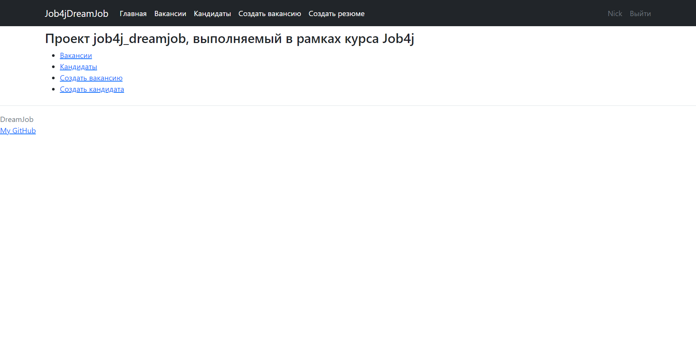
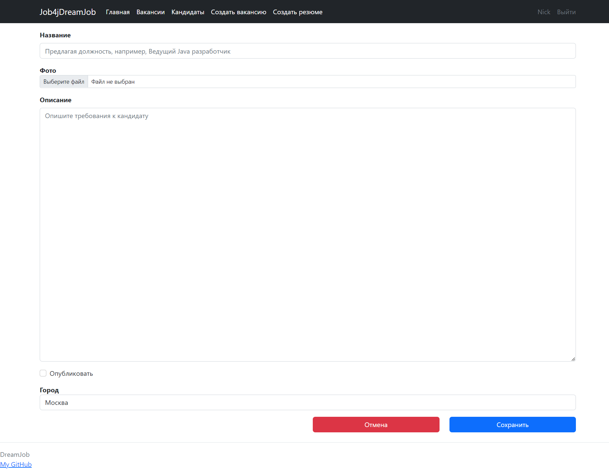
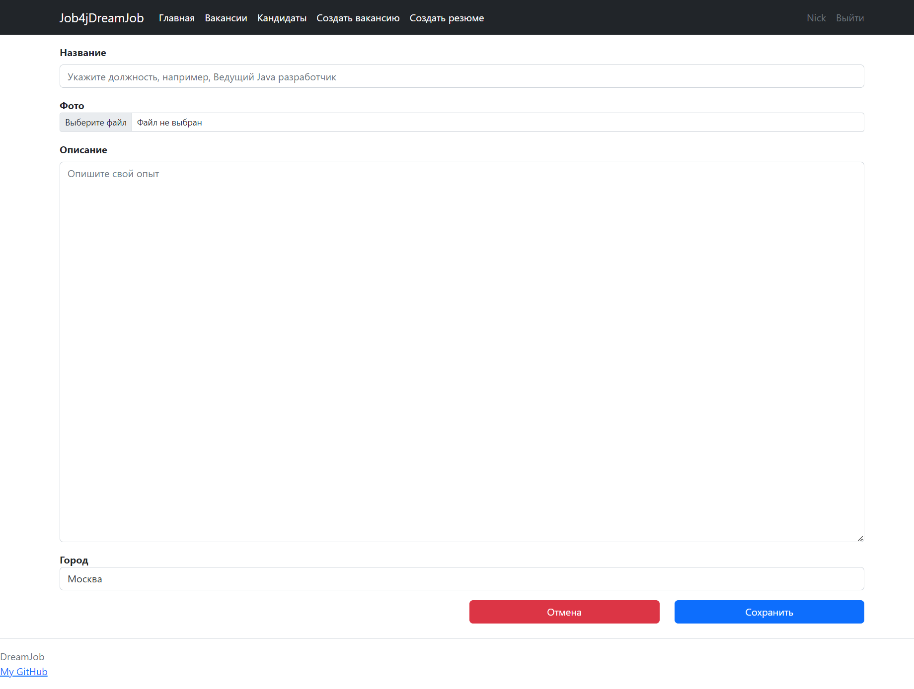
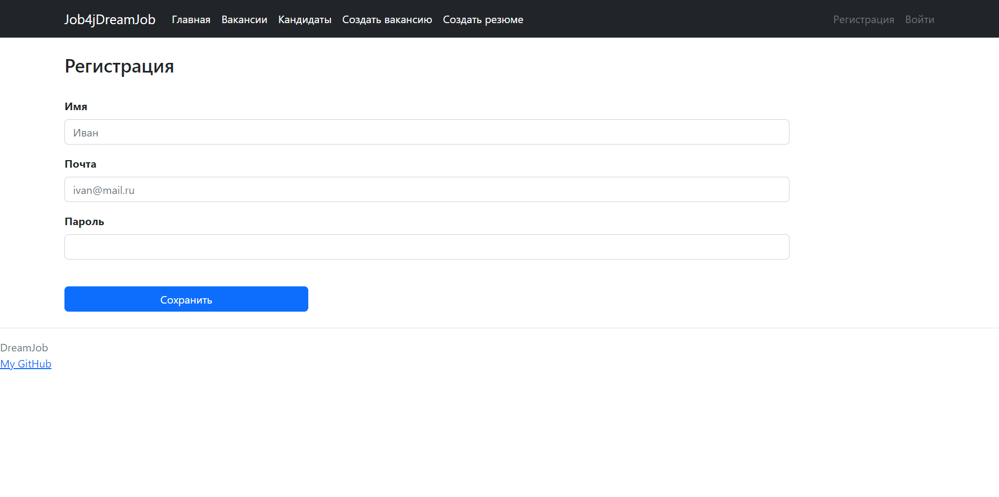
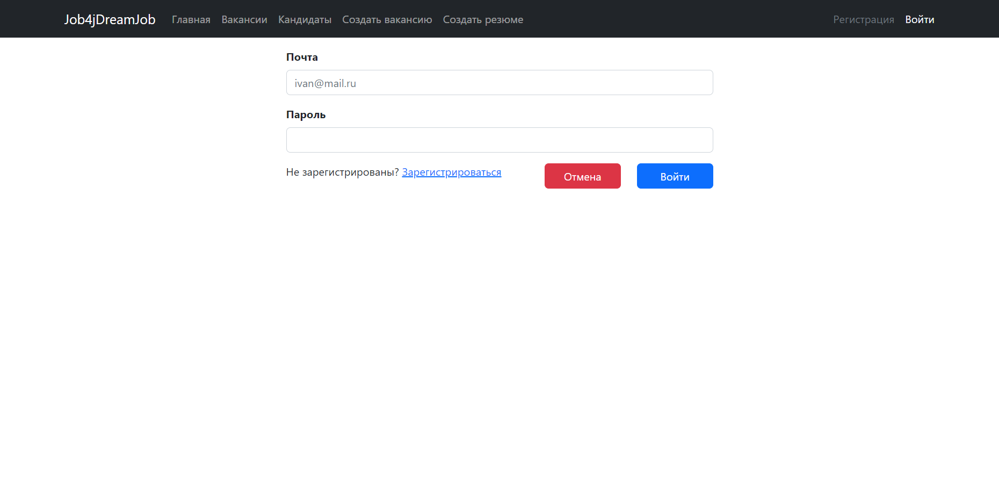

Проект "Работа мечты" job4j_dreamjob
---

>Это веб приложение реализует CRUD-систему с использованием MVC шаблона.

## Содержание

- [Обшая инофмация](#Общая-информация)
- [Технологии](#Технологии)
- [Запуск проекта](#Запуск-проекта)
- [Скриншоты](#Скриншоты)
- [Контакты](#Контакты)

## Общая информация

В системе две модели: вакансии и кандидаты. Кандидаты будут публиковать резюме. Кадровики будут
публиковать вакансии о работе.
Кандидаты могут откликнуться на вакансию. Кадровик может пригласить на вакансию кандидата.

## Технологии

- Java 17
- Database:
    - PostgreSQL 14
    - H2
- JDBC
- Sql2o
- Liquibase
- Spring boot
- Apache TomCat
- HTML, Thymeleaf, Bootstrap
- Junit, Mockito
- Maven

## Запуск проекта

```
create database dreamjob;
```
```
mvn compile;
```

## Скриншоты

#### Главная страница

#### Страница создания вакансии

#### Страница создания резюме

#### Страница Регистрации

#### Страница Авторизации



## Контакты

https://github.com/ADIKIAA